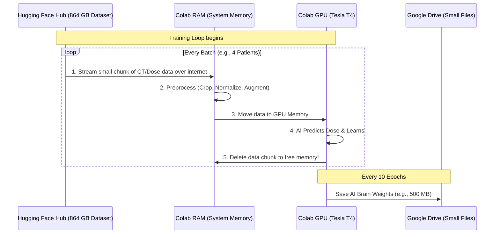

# Google Colab Data Streaming Workflow

When dealing with a massive dataset like DoseRAD2026 (864 GB), it is physically impossible to download it all to a free Google Colab machine, which only has about 70 GB of disk space. 

Instead, we use a concept called **Data Streaming** (or "piping"). Here is exactly how it works.

## The Architecture



## How "Piping" Works

Think of it like watching a 4K movie on Netflix:
1. **Downloading (The old way):** You wait hours to download the entire 50 GB movie file to your hard drive before you can start watching.
2. **Streaming (Our way):** Netflix sends the video to your computer 10 seconds at a time. Your computer plays those 10 seconds, immediately deletes them, and grabs the next 10 seconds. You never store the 50 GB file.

We do the exact same thing with the medical data using the `datasets` library from Hugging Face:

```python
# The magic keyword is "streaming=True"
from datasets import load_dataset

dataset = load_dataset("doserad2026/dataset", streaming=True)

for patient_data in dataset:
    # 1. We receive one patient's CT scan over the internet
    # 2. We train the AI on it
    # 3. We instantly discard it and grab the next patient
    train_model(patient_data)
```

### The Project Workflow

1. **Coding (Here in your IDE):** We will write all the Python scripts (like the code above) right here in your `DoseRAD` folder.
2. **Syncing (GitHub):** We will upload these scripts to a free GitHub repository.
3. **Execution (Google Colab):** You open Colab, run a command to download your scripts from GitHub, and press "Play". Colab connects to Hugging Face, streams the data, trains the AI, and saves the final lightweight AI model to your Google Drive. 

By the time you need to submit to the Grand Challenge, you'll only have a tiny `model_weights.pth` file (usually less than 1 GB) that holds all the knowledge the AI learned from the 864 GB dataset!
